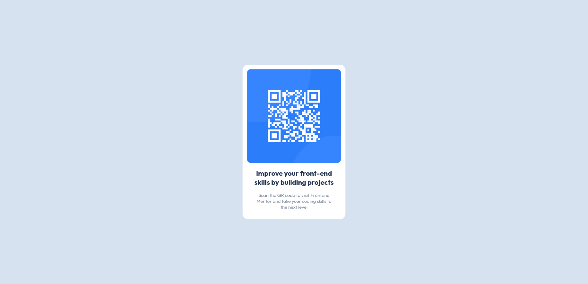

# Frontend Mentor - QR code component solution

This is a solution to the [QR code component challenge on Frontend Mentor](https://www.frontendmentor.io/challenges/qr-code-component-iux_sIO_H). Frontend Mentor challenges help you improve your coding skills by building realistic projects. 

## Table of contents

- [Overview](#overview)
  - [Screenshot](#screenshot)
  - [Links](#links)
- [My process](#my-process)
  - [Built with](#built-with)
  - [What I learned](#what-i-learned)
  - [Useful resources](#useful-resources)
- [Author](#author)

## Overview

### Screenshot

### Links

- Solution URL: [Repo](https://github.com/aopuce/qr-code-component)
- Live Site URL: [qr-code-component-chi-drab.vercel.app](https://qr-code-component-chi-drab.vercel.app/)

## My process
I used CSS grids to center the main div and CSS custom properties to save colors.

### Built with

- Semantic HTML5 markup
- CSS custom properties
- CSS Grid
- Mobile-first workflow

### What I learned
Improve css and custom properties.

### Useful resources

- [CSS custom properties](https://developer.mozilla.org/en-US/docs/Web/CSS/Using_CSS_custom_properties) - Css custom properties docs.

## Author

- Frontend Mentor - [@aopuce](https://www.frontendmentor.io/profile/aopuce)
- Twitter - [@aopuce](https://www.twitter.com/aopuce)

